 # CV Studio

 > A node-based geospatial vision platform for flow analytics, mapping, and spatial decision support.


[](LICENSE)
[](https://www.python.org/)
[](https://opencv.org/)

## 🎯 Overview

CV Studio helps teams **observe, count, localize, map, and compare activity over time** through
visual pipelines. It is positioned first as a platform for **retail intelligence**, **urban
analytics**, and **spatial decision support**.

You connect **video or field data** to **detection, tracking, analytics, and map layers**, then
publish results to **dashboards, databases, or APIs** without building custom glue code for every
workflow.

## 🧭 Why Teams Use CV Studio

- **Retail intelligence** — Measure occupancy, footfall, hot zones, and in-store movement from
  existing camera feeds
- **Urban analytics** — Analyze density, trajectories, curb activity, and space usage across
  streets, stations, and facilities
- **Spatial decision support** — Combine detections, coordinates, maps, and satellite imagery for
  territory monitoring and site review

## ⚙️ How It Works

```mermaid
flowchart LR
    subgraph Inputs["📥 Acquisition"]
        A1["Webcam / Video"]
        A2["RTSP · HLS · WebRTC"]
        A3["GPS / JSON / MQTT / API"]
        A4["Satellite / Copernicus"]
    end
    subgraph Process["⚙️ Detection, Tracking &amp; Analytics"]
        B1["Object Detection<br/>(ONNX · YOLO)"]
        B2["Tracking &amp;<br/>Trajectories"]
        B3["Heatmaps · Charts<br/>&amp; Spatial Analysis"]
    end
    subgraph Outputs["📤 Spatial Outputs"]
        C1["Maps &amp;<br/>Satellite Context"]
        C2["Overlays · Views<br/>&amp; Dashboards"]
        C3["MongoDB · MQTT<br/>API / JSON"]
    end

    Inputs --> Process --> Outputs

    style Inputs fill:#e3f2fd,stroke:#1976d2,color:#0d47a1
    style Process fill:#f3e5f5,stroke:#7b1fa2,color:#4a148c
    style Outputs fill:#e8f5e9,stroke:#388e3c,color:#1b5e20
```



## ✨ Core Workflows

- **Retail flow analysis** — Camera → detection → tracking → heatmap / chart → occupancy and
  movement insight
- **Urban mobility analysis** — Street or facility feed → trajectories → map overlay → density and
  path interpretation
- **Spatial diagnostics** — Coordinates + satellite imagery + detections → site context and
  territory monitoring

## 🧱 Core Platform

- **Visual workflow builder** for node-based pipeline design with real-time previews
- **Video, stream, and field inputs** including webcam, RTSP, HLS, WebRTC, JSON, MQTT, API, and
  satellite imagery
- **Detection, tracking, and analytics** with ONNX / YOLO models, MOT, trajectories, heatmaps, and
  charts
- **Spatial outputs and integrations** for map overlays, dashboards, MongoDB, MQTT, and API export
- **Reusable pipelines** saved as JSON for repeatable analysis and demos

## 🎥 See It In Action

The demos below are ordered to tell the product story first: overview, live analytics, workflow
construction, model operations, and advanced pipelines.

<table>
  <tr>
    <td align="center" width="33%">
      <a href="https://youtu.be/TfLSFDp87cE">
        <br/>
        <b>▶️ Platform Overview</b>
      </a>
    </td>
    <td align="center" width="33%">
      <a href="https://youtu.be/9R3tdSiQISE">
        <br/>
        <b>▶️ Live Video Analytics</b>
      </a>
    </td>
    <td align="center" width="33%">
      <a href="https://youtu.be/wz6MARjZr9w">
        <br/>
        <b>▶️ Workflow Builder</b>
      </a>
    </td>
  </tr>
  <tr>
    <td align="center" width="33%">
      <a href="https://youtu.be/JBO2-gcgkiU">
        <br/>
        <b>▶️ Detection &amp; Tracking Modules</b>
      </a>
    </td>
    <td align="center" width="33%">
      <a href="https://youtu.be/lSLuxiJwC4Q">
        <br/>
        <b>▶️ Advanced Pipeline</b>
      </a>
    </td>
    <td align="center" width="33%"></td>
  </tr>
</table>

> 💡 Click any thumbnail to watch the full video on YouTube.

## 🚀 Quick Start

```bash
git clone https://github.com/hackolite/CV_Studio.git
cd CV_Studio
pip install -r requirements.txt
python main.py
```

### Need detailed setup?

- **General installation:** [doc/INSTALLATION.md](doc/INSTALLATION.md)
- **Windows install:** [English](doc/INSTALLATION_WINDOWS.md) · [Français](doc/INSTALLATION_WINDOWS_FR.md)
- **Get the Windows executable:** [English](doc/HOW_TO_GET_EXE.md) · [Français](doc/COMMENT_OBTENIR_EXE.md)
- **Build guides:** [Quick reference](doc/BUILD_QUICKREF.md) · [Full guide](doc/BUILD_GUIDE.md)

## 📚 Documentation Map

- **Full documentation:** [doc/DOCUMENTATION.md](doc/DOCUMENTATION.md)
- **Architecture overview:** [src/README.md](src/README.md)
- **Queue system details:** [doc/TIMESTAMPED_QUEUE_SYSTEM.md](doc/TIMESTAMPED_QUEUE_SYSTEM.md)
- **Examples and demos:** [examples/README.md](examples/README.md)
- **Testing guide:** [doc/TESTING.md](doc/TESTING.md)

## 🧩 Node Library

CV Studio includes a broad node library spanning:

- **Inputs** — image, video, webcam, RTSP, HLS, WebRTC, WebSocket, MQTT, API, GPS, microphone
- **Vision processing** — filtering, transforms, enhancement, thresholding, overlays
- **AI inference** — object detection, segmentation, classification, pose, depth, tracking, audio
- **Spatial analytics** — maps, coordinate streams, trajectories, heatmaps, charts, satellite layers
- **Outputs and actions** — visualization, JSON export, MongoDB, MQTT, APIs, workflow persistence

For the complete node catalog and detailed descriptions, see
[doc/DOCUMENTATION.md](doc/DOCUMENTATION.md).

## 🧪 Testing

```bash
python -m pytest tests/ -v
```

For focused validation and testing notes, see [doc/TESTING.md](doc/TESTING.md).

## 🛠️ Development

- Use the modern architecture in [src/README.md](src/README.md) for new work
- Review examples in [examples/README.md](examples/README.md)
- Keep documentation and tests updated with changes

## 📋 Roadmap

- Improve graph editing and import reliability
- Continue GUI and plugin-system refactoring
- Expand type safety, monitoring, and export capabilities

## 👥 Authors & Contributors

**Original Author:**  
Fork from Kazuhito Takahashi ([@KzhtTkhs](https://twitter.com/KzhtTkhs))

**Repository Builder :**  
[hackolite](https://github.com/hackolite)

We appreciate all contributions from the community!

## 📄 License

This project is licensed under the **Apache License 2.0** - see the [LICENSE](LICENSE) file for details.

### Important License Notes

- The source code of CV Studio itself is under [Apache-2.0 license](LICENSE)
- Each algorithm/node implementation is subject to its own license
- Please check the LICENSE file in each node directory for specific algorithm licenses
- Third-party dependencies have their own licenses

### Image License

Sample images are sourced from:
- [Free Material Pakutaso](https://www.pakutaso.com/)
- [NHK Creative Library](https://www.nhk.or.jp/archives)

## 🙏 Acknowledgments

- Original [Image-Processing-Node-Editor](https://github.com/Kazuhito00/Image-Processing-Node-Editor) project
- [DearPyGUI](https://github.com/hoffstadt/DearPyGui) for the GUI framework
- [OpenCV](https://opencv.org/) for computer vision functionality
- [ONNX Runtime](https://onnxruntime.ai/) for ML model inference
- [MediaPipe](https://mediapipe.dev/) for ML solutions
- All contributors and users of this project

## 📞 Support

- **Issues:** [GitHub Issues](https://github.com/hackolite/CV_Studio/issues)
- **Discussions:** [GitHub Discussions](https://github.com/hackolite/CV_Studio/discussions)
- **Documentation:** See the docs in this repository

---

<div align="center">

**Made with ❤️ for the Computer Vision Community**

⭐ Star this repo if you find it useful!

</div>
