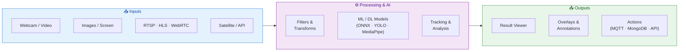
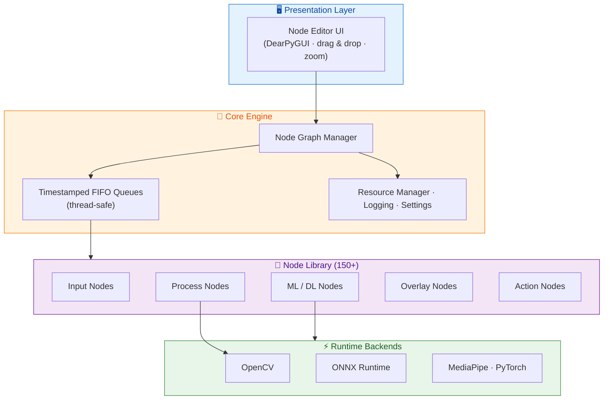
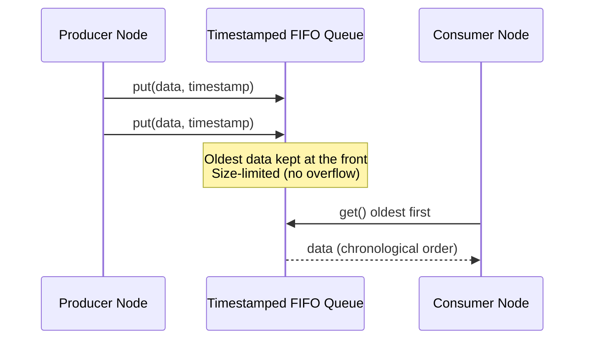

 # CV Studio

> A professional node-based image processing application for computer vision development, verification, and comparison.


[](LICENSE)
[](https://www.python.org/)
[](https://opencv.org/)

## 🎯 Overview

CV Studio is an advanced node-based image processing application that allows you to visually create computer vision pipelines through an intuitive drag-and-drop interface. Perfect for:

- **Prototyping** - Quickly test and compare different CV algorithms
- **Education** - Learn computer vision concepts interactively
- **Development** - Build and validate processing pipelines before production
- **Research** - Experiment with ML models and traditional CV techniques

### How It Works

CV Studio turns computer vision development into a visual workflow. You connect **Input** nodes to
**Processing**, **ML/DL**, and **Analysis** nodes, then send the results to **Visualization** or
**Action** nodes — no boilerplate code required. Data flows through the graph in real time.



## ✨ Key Features

- 🎨 **Visual Node Editor** - Intuitive drag-and-drop interface powered by DearPyGUI
- 🔄 **Real-time Processing** - See results instantly as you build your pipeline
- 🧩 **150+ Built-in Nodes** - Input, processing, ML/DL, audio, analysis, visualization, and action nodes
- 🤖 **ML/DL Integration** - ONNX, MediaPipe, YOLOv8/YOLO11, YAMNet, VLM and custom models
- 📹 **Multiple Input Sources** - Webcam, video, images, RTSP, HLS, WebRTC, WebSocket, MQTT, API, YouTube, screen capture
- 🔊 **Audio Pipeline** - Microphone input → audio processing → AudioClassification with passthrough sync
- 🗺️ **Satellite Imagery** - Copernicus/Sentinel-2 live tile streaming with band combinations and NDVI formulas
- 🧠 **On-Device Training** - OnlineTraining node for live distillation fine-tuning (PyTorch backprop)
- ➕ **In-Node Model Import** - Upload custom ONNX models directly from any DL node UI without restarting
- 💾 **Save & Load** - Export and import your processing graphs as JSON
- 🏗️ **Modern Architecture** - Professional codebase with proper error handling, logging, and testing
- 🔌 **Extensible** - Easy to add custom nodes and processing algorithms

## 🎥 See It In Action

The following demonstrations were produced **entirely inside CV Studio**. They show real pipelines
running end-to-end — from live input to AI inference and visualization — so you can see exactly what
the studio delivers before installing it.

<table>
  <tr>
    <td align="center" width="33%">
      <a href="https://youtu.be/TfLSFDp87cE">
        <br/>
        <b>▶️ Demo 1 — CV Studio in Action</b>
      </a>
    </td>
    <td align="center" width="33%">
      <a href="https://youtu.be/wz6MARjZr9w">
        <br/>
        <b>▶️ Demo 2 — Building a Vision Pipeline</b>
      </a>
    </td>
    <td align="center" width="33%">
      <a href="https://youtu.be/9R3tdSiQISE">
        <br/>
        <b>▶️ Demo 3 — Real-Time Processing</b>
      </a>
    </td>
  </tr>
  <tr>
    <td align="center" width="33%">
      <a href="https://youtu.be/JBO2-gcgkiU">
        <br/>
        <b>▶️ Demo 4 — Models &amp; Detection</b>
      </a>
    </td>
    <td align="center" width="33%">
      <a href="https://youtu.be/lSLuxiJwC4Q">
        <br/>
        <b>▶️ Demo 5 — Advanced Workflow</b>
      </a>
    </td>
    <td align="center" width="33%"></td>
  </tr>
</table>

> 💡 Click any thumbnail to watch the full video on YouTube.

## 📋 Requirements

```
Python          3.7 or later
opencv-python   4.5.5.64 or later
onnxruntime     1.16.0 or later
dearpygui       2.0.0 or later
mediapipe       0.8.10 or later  ※ Required for MediaPipe nodes
protobuf        3.20.0 or later  ※ Required for MediaPipe nodes
filterpy        1.4.5 or later   ※ Required for MOT (Multi-Object Tracking) nodes
librosa         0.9.0 or later   ※ Required for AudioClassification and audio resampling
sounddevice     0.4.0 or later   ※ Required for Microphone node
pymongo         4.0.0 or later   ※ Required for MongoDB action node
requests        2.28.0 or later  ※ Required for VLM and CopernicusMap nodes
torch           1.13.0 or later  ※ Optional, enables OnlineTraining backprop
onnx2torch      1.5.0 or later   ※ Optional, enables OnlineTraining ONNX→torch conversion
```

## 🚀 Installation

> **📘 Windows Users**: For detailed Windows-specific installation instructions with troubleshooting, see:
> - 🇬🇧 [INSTALLATION_WINDOWS.md](doc/INSTALLATION_WINDOWS.md) (English)
> - 🇫🇷 [INSTALLATION_WINDOWS_FR.md](doc/INSTALLATION_WINDOWS_FR.md) (Français)

### Method 1: Direct Installation (Recommended)

1. **Clone the repository**
   ```bash
   git clone https://github.com/hackolite/CV_Studio.git
   cd CV_Studio
   ```

2. **Install dependencies**
   ```bash
   pip install -r requirements.txt
   ```

3. **Run the application**
   ```bash
   python main.py
   ```

### Method 2: Using Virtual Environment (Recommended for Development)

```bash
# Create virtual environment
python -m venv venv

# Activate virtual environment
# On Windows:
venv\Scripts\activate
# On Linux/Mac:
source venv/bin/activate

# Install dependencies
pip install -r requirements.txt

# Run the application
python main.py
```

### Method 3: Pip Installation

```bash
# Install build tools first
# Windows: https://visualstudio.microsoft.com/visual-cpp-build-tools/
# Ubuntu: sudo apt-get install build-essential libssl-dev libffi-dev python3-dev

# Install required packages
pip install Cython numpy wheel

# Install from GitHub
pip install git+https://github.com/hackolite/CV_Studio.git

# Run the application
ipn-editor
```

### Method 4: Docker

See [Image-Processing-Node-Editor/docker/nvidia-gpu](https://github.com/Kazuhito00/Image-Processing-Node-Editor/tree/main/docker/nvidia-gpu) for Docker setup instructions.  

### Method 5: Standalone Executable (Windows)

For Windows users who want a standalone .exe file that doesn't require Python installation:

#### 🎯 Option A: Automatic Build via GitHub Actions (EASIEST - NO LOCAL BUILD NEEDED)

**No Python or build tools installation required!** Simply trigger a build on GitHub:

1. **Go to the [Actions tab](../../actions)** in this repository
2. **Click on "Build Windows Executable"** in the left sidebar
3. **Click "Run workflow"** → Select branch → Click green "Run workflow" button
4. **Wait 10-15 minutes** for the build to complete
5. **Download** the `CV_Studio-Windows-Executable.zip` from the Artifacts section
6. **Extract and run** `CV_Studio.exe` - Done! 🎉

📖 **Detailed instructions:** See [COMMENT_OBTENIR_EXE.md](doc/COMMENT_OBTENIR_EXE.md) (Français) or [HOW_TO_GET_EXE.md](doc/HOW_TO_GET_EXE.md) (English)

#### 🎬 Option B: Automated Build Script (RECOMMENDED FOR LOCAL BUILD)

**The easiest way to build locally!** Just download and run a script that does everything automatically:

**Using Batch Script (Simple - Double-click to run):**
1. Download [`build_windows.bat`](build_windows.bat)
2. Double-click the file
3. Wait 5-15 minutes
4. Find your executable in `dist/CV_Studio/CV_Studio.exe`

**Using PowerShell (Modern):**
```powershell
# Download the script (or clone the repo to get it)
powershell -ExecutionPolicy Bypass -File build_windows.ps1
```

The script automatically:
- ✅ Clones the repository (if needed)
- ✅ Installs all Python dependencies
- ✅ Builds the .exe with PyInstaller
- ✅ Shows you where to find the result

📖 **Full guide:** See [BUILD_WINDOWS_SCRIPT.md](doc/BUILD_WINDOWS_SCRIPT.md) for detailed instructions and troubleshooting

#### ⚡ Option C: Unified Build System (NEW - CROSS-PLATFORM)

**The modern, clean way to build CV_Studio!** Works on Windows, Linux, and macOS.

```bash
# Clone repository
git clone https://github.com/hackolite/CV_Studio.git
cd CV_Studio

# Install dependencies
pip install -r requirements.txt

# Build executable (GPU support)
python build_unified.py --clean

# Or build for CPU-only (no CUDA required)
python build_unified.py --clean --cpu
```

**Features:**
- ✅ Cross-platform (Windows/Linux/macOS)
- ✅ Clean, colored output
- ✅ CPU/GPU build modes
- ✅ Comprehensive error handling
- ✅ Single command builds
- ✅ CI/CD friendly

**Quick Reference:**
- 📖 [BUILD_QUICKREF.md](doc/BUILD_QUICKREF.md) - One-page cheat sheet
- 📚 [BUILD_GUIDE.md](doc/BUILD_GUIDE.md) - Comprehensive guide

#### 🔧 Option D: Manual Build on Your Windows Machine (Legacy)

#### 📋 Prérequis / Prerequisites

Before building the executable, ensure you have:
- **Python 3.7+** installed (tested with Python 3.12)
- **Git** for cloning the repository
- **Windows OS** (for building Windows executables)

#### 🔧 Étapes de création du .exe / Step-by-Step Build Instructions

**Étape 1 : Cloner le dépôt / Step 1: Clone the repository**

```bash
git clone https://github.com/hackolite/CV_Studio.git
cd CV_Studio
```

**Étape 2 : Installer les dépendances principales / Step 2: Install main dependencies**

```bash
# Install main dependencies
pip install -r requirements.txt
```

**Étape 3 : Installer les dépendances de build / Step 3: Install build dependencies**

```bash
# Install PyInstaller and build tools
pip install -r requirements-build.txt
# Or manually: pip install pyinstaller
```

**Étape 4 : Construire l'exécutable / Step 4: Build the executable**

```bash
# Standard build with clean
python build_exe.py --clean

# Alternative: Build without console window (GUI only)
python build_exe.py --clean --windowed

# Alternative: With custom icon
python build_exe.py --clean --icon your_icon.ico
```

The build process will:
1. ✅ Verify all dependencies are installed
2. ✅ Clean previous build artifacts (if --clean flag used)
3. ✅ Package all Python dependencies
4. ✅ Include all nodes (Input, Process, DL, Audio, etc.)
5. ✅ Bundle all ONNX models for object detection
6. ✅ Create the standalone executable

**Build time:** Approximately 5-15 minutes depending on your system.

**Étape 5 : Localiser l'exécutable / Step 5: Locate your executable**

Your .exe file is ready at:
```
dist/CV_Studio/CV_Studio.exe
```

The `dist/CV_Studio/` folder contains:
- `CV_Studio.exe` - Main executable
- `node/` - All node implementations and ONNX models
- `node_editor/` - Editor core and settings
- `src/` - Source utilities
- `_internal/` - Python runtime and dependencies

**Étape 6 : Tester l'exécutable / Step 6: Test the executable**

```bash
# Navigate to the dist folder
cd dist/CV_Studio

# Run the executable
CV_Studio.exe

# Or run with debug output
CV_Studio.exe --use_debug_print
```

**Étape 7 : Vérifier les fonctionnalités / Step 7: Verify functionality**

Test that everything works:
1. Open the application
2. Add an **Image** node (Input → Image)
3. Add an **Object Detection** node (VisionModel → Object Detection)
4. Select a YOLOX model
5. Add a **Result Image** node
6. Connect the nodes and verify object detection works

**Étape 8 : Distribution / Step 8: Distribution**

To share your executable:

```bash
# Create a ZIP archive
cd dist
# On Windows PowerShell:
Compress-Archive -Path CV_Studio -DestinationPath CV_Studio_v1.0.zip

# Or use 7-Zip (if installed):
7z a CV_Studio_v1.0.zip CV_Studio
```

The ZIP file can be distributed to users who just need to:
1. Extract the ZIP file
2. Run `CV_Studio.exe`
3. No Python installation required!

#### 📦 What's included in the executable

- ✅ All nodes (Input, Process, DL, Audio, etc.)
- ✅ All ONNX models for object detection (YOLOX, YOLO, FreeYOLO, etc.)
- ✅ Complete Python runtime (no separate Python installation needed)
- ✅ All required libraries (OpenCV, DearPyGUI, ONNX Runtime, etc.)
- ✅ Configuration files and fonts

**Size:** Approximately 800 MB - 1.5 GB

#### 🔍 Options de build avancées / Advanced Build Options

```bash
# Clean build (recommended)
python build_exe.py --clean

# GUI mode without console window
python build_exe.py --windowed

# Debug mode with detailed logging
python build_exe.py --debug

# Custom icon (if you have an icon file)
python build_exe.py --icon your_icon.ico

# Combine options
python build_exe.py --clean --windowed --icon your_icon.ico
```

#### ⚠️ Dépannage / Troubleshooting

**Problem:** PyInstaller not found
```bash
pip install pyinstaller
```

**Problem:** Missing dependencies
```bash
pip install -r requirements.txt
pip install -r requirements-build.txt
```

**Problem:** Exe doesn't start
- Install [Visual C++ Redistributable](https://aka.ms/vs/17/release/vc_redist.x64.exe)
- Run from command line to see error messages: `CV_Studio.exe --use_debug_print`
- Check antivirus isn't blocking the executable

**Problem:** ONNX models not found
- Verify the `dist/CV_Studio/node/DLNode/` directory structure is intact
- Rebuild with `python build_exe.py --clean`

#### 📚 Documentation détaillée / Detailed Documentation

**For comprehensive guides, see:**
- [Quick Reference](doc/BUILD_EXE_QUICKREF.md) - Quick start guide
- [Full Guide (English)](doc/BUILD_EXE_GUIDE.md) - Complete documentation with all options
- [Guide complet (Français)](doc/BUILD_EXE_GUIDE_FR.md) - Documentation complète en français

## 💡 Usage

### Basic Usage

Start the application with:
```bash
python main.py
```

#### Command Line Options

- `--setting <path>` - Specify custom configuration file (default: `node_editor/setting/setting.json`)
- `--unuse_async_draw` - Disable asynchronous drawing for debugging
- `--use_debug_print` - Enable debug output

**Example:**
```bash
python main.py --setting custom_config.json --use_debug_print
```

### Quick Start Guide

#### 1. Create a Node
Select a node from the menu and click to add it to the canvas.


#### 2. Connect Nodes
Drag from an output terminal to an input terminal to create connections. Only compatible terminal types can be connected.


#### 3. Zoom and Navigate
Use the **mouse wheel** to zoom in and out of the node editor canvas (range: 10% to 500%). The current zoom level is displayed in the menu bar. Use the **View menu** for precise zoom controls.

<details>
<summary>🔍 Zoom Controls</summary>

- **Mouse Wheel Up/Down**: Zoom in/out by 10% per scroll
- **View → Zoom In**: Zoom in by 10%
- **View → Zoom Out**: Zoom out by 10%
- **View → Reset Zoom**: Return to 100%
- **Zoom Range**: 0.1x (10%) to 5.0x (500%)

For more details, see [Node Editor Zoom Controls](docs/NODE_EDITOR_ZOOM_CONTROLS.md).

</details>

#### 4. Delete a Node
Select the node and press the **Delete** key.


#### 5. Export Your Graph
Save your processing pipeline as a JSON file via the **Export** menu option.


#### 6. Import a Graph
Load a previously saved processing pipeline from a JSON file.


### Workflow Examples

Here are some practical examples to help you get started with common computer vision tasks:

#### Standalone Examples

For complete, runnable code examples including DearPyGui usage patterns, see the **[examples/](examples/)** directory:

- **[dearpygui_node_editor_colored_combo_example.py](examples/dearpygui_node_editor_colored_combo_example.py)** - Demonstrates node editor with themed combo boxes, domain-based coloring, and dynamic UI updates

See **[examples/README.md](examples/README.md)** for detailed documentation on each example.

#### Example 1: Basic Image Processing Pipeline

**Task:** Apply blur and edge detection to an image

1. Add an **Image** node (Input → Image)
2. Add a **Blur** node (VisionProcess → Blur)
3. Add a **Canny** node (VisionProcess → Canny)
4. Add a **Result Image** node (Visual → Result Image)
5. Connect: Image → Blur → Canny → Result Image
6. Click "Select Image" in the Image node to load your image
7. Adjust blur and Canny parameters using the sliders

**Result:** You'll see real-time edge detection applied to your blurred image.

#### Example 2: Webcam Object Detection

**Task:** Detect objects in real-time from your webcam

1. Add a **WebCam** node (Input → WebCam)
2. Add an **Object Detection** node (VisionModel → Object Detection)
3. Add a **Draw Information** node (Overlay → Draw Information)
4. Add a **Result Image** node (Visual → Result Image)
5. Connect: WebCam → Object Detection → Draw Information → Result Image
6. Select your camera device in the WebCam node
7. Choose a detection model in the Object Detection node

**Result:** Real-time object detection with bounding boxes drawn on your webcam feed.

#### Example 3: Video Processing with Multiple Effects

**Task:** Process a video file with multiple filters

1. Add a **Video** node (Input → Video)
2. Add multiple processing nodes (e.g., **Brightness**, **Contrast**, **Grayscale**)
3. Add an **Image Concat** node (Overlay → Image Concat) to compare results
4. Add a **Result Image** node (Visual → Result Image)
5. Connect the Video node to each processing node
6. Connect all processing outputs to the Image Concat node
7. Connect Image Concat to Result Image

**Result:** Side-by-side comparison of different processing effects on your video.

#### Example 4: Face Detection and Analysis

**Task:** Detect faces and apply effects

1. Add an **Image** or **WebCam** node
2. Add a **Face Detection** node (VisionModel → Face Detection)
3. Add a **Draw Information** node (Overlay → Draw Information)
4. Add a **Crop** node (VisionProcess → Crop) - optional, to extract faces
5. Connect nodes in sequence
6. Use the Draw Information node to visualize detected faces

**Result:** Automatic face detection with bounding boxes and optional face extraction.

### Tips & Best Practices

#### Working with Nodes

- **Organize Your Workspace:** Arrange nodes logically from left (inputs) to right (outputs) for better readability
- **Use Image Concat:** Compare different processing approaches side-by-side using the Image Concat node
- **Check Terminal Colors:** Nodes can only connect if terminal types match (indicated by color)
- **Start Simple:** Begin with a basic pipeline and add complexity incrementally
- **Save Frequently:** Use Export to save your work regularly

#### Performance Optimization

- **Reduce Resolution:** Use the **Resize** node early in your pipeline to speed up processing
- **Toggle Nodes:** Use the **ON/OFF Switch** node to temporarily disable expensive operations
- **Limit Video FPS:** Adjust skip rate in Video nodes to process fewer frames
- **GPU Acceleration:** Enable GPU in Deep Learning nodes when available (requires ONNX Runtime GPU)

#### Debugging and Testing

- **Use Debug Print:** Launch with `--use_debug_print` to see detailed node execution logs
- **Disable Async Draw:** Use `--unuse_async_draw` if you experience UI issues
- **Check Connections:** Verify all node connections are properly established (no red indicators)
- **Monitor Performance:** Use the **FPS** node to track processing speed
- **Test Incrementally:** Add one node at a time and verify it works before adding more

#### Node Selection Tips

- **Input Nodes:** 
  - Use **Image** for static images and prototyping
  - Use **WebCam** for real-time testing
  - Use **Video** for batch processing and testing on recorded content
  - Use **RTSP** for network camera streams

- **Processing Nodes:**
  - Start with basic nodes (Brightness, Contrast, Blur) before complex ones
  - Chain multiple processing nodes to create sophisticated effects
  - Use **Grayscale** before **Threshold** for better results

- **ML/DL Nodes:**
  - Check GPU availability before enabling GPU inference
  - Different models have different performance characteristics - experiment!
  - Combine detection nodes with tracking for smoother results

- **Visualization:**
  - Use **Result Image** for final output
  - Use **Result Image (Large)** when you need more detail
  - Use **PutText** to add custom labels and timing information
  - Use **RGB Histogram** for color analysis

### Keyboard Shortcuts & UI Interactions

| Action | Shortcut/Method |
|--------|----------------|
| **Add Node** | Click menu item, then click on canvas |
| **Delete Node** | Select node, press `Delete` key |
| **Pan Canvas** | Middle mouse button drag or `Ctrl` + Left mouse drag |
| **Connect Nodes** | Drag from output terminal to input terminal |
| **Disconnect Nodes** | Right-click on connection line, select delete |
| **Select Multiple** | `Ctrl` + Click on nodes |
| **Minimap** | Click minimap in bottom-right to navigate large graphs |

### Troubleshooting

#### Common Issues and Solutions

**Problem:** Application crashes on startup
- **Solution:** Check if required dependencies are installed: `pip install -r requirements.txt`
- **Solution:** Ensure you have a compatible Python version (3.7+)
- **Solution:** Try disabling async drawing: `python main.py --unuse_async_draw`

**Problem:** Webcam not detected
- **Solution:** Close other applications using the webcam
- **Solution:** Check camera permissions in your OS settings
- **Solution:** Try different device numbers in the WebCam node dropdown

**Problem:** Cannot connect two nodes
- **Solution:** Verify terminal types match (same color)
- **Solution:** Check that output terminal connects to input terminal (not output to output)
- **Solution:** Some nodes require specific input types - check node documentation

**Problem:** Deep Learning node shows "Model not found" error
- **Solution:** Download the required model files (see node-specific README files)
- **Solution:** Check the model path in the node configuration
- **Solution:** Verify you have the correct ONNX runtime installed

**Problem:** Low FPS / Slow processing
- **Solution:** Add a **Resize** node to reduce image resolution
- **Solution:** Enable GPU acceleration in DL nodes if available
- **Solution:** Reduce video skip rate or use lower resolution input
- **Solution:** Close unnecessary nodes and connections

**Problem:** Export/Import doesn't work
- **Solution:** Ensure you're saving to a writable location
- **Solution:** Check that the JSON file is valid and not corrupted
- **Solution:** Import files should be loaded before adding new nodes

**Problem:** Node parameters don't update
- **Solution:** Try reconnecting the node connections
- **Solution:** Restart the application
- **Solution:** Check if the node is receiving valid input data

### Advanced Usage

#### Custom Configuration Files

Create custom configuration files to save your preferred settings:

```bash
# Create a custom config
cp node_editor/setting/setting.json my_config.json

# Edit my_config.json to set your preferences
# - webcam_width/height: Camera resolution
# - process_width/height: Processing resolution  
# - editor_width/height: Window size
# - use_gpu: Enable GPU acceleration
# - use_pref_counter: Enable performance monitoring

# Run with custom config
python main.py --setting my_config.json
```

#### Working with Multiple Cameras

CV Studio supports multiple cameras simultaneously:

1. The application automatically detects available cameras on startup
2. Each **WebCam** node can select a different camera device
3. Use multiple WebCam nodes to process multiple camera feeds in parallel
4. Combine feeds using **Image Concat** for multi-camera display

#### Creating Custom Nodes

Extend CV Studio with your own nodes:

```python
# Create a new node file in node/ProcessNode/
from node.ProcessNode.node_abc import ProcessNodeABC

class MyCustomNode(ProcessNodeABC):
    node_label = 'My Custom Filter'
    node_tag = 'MyCustomFilter'
    
    def update(self, node_id, connection_list, node_image_dict, node_result_dict):
        # Your processing logic here
        input_image = self._get_input_image(node_image_dict, connection_list)
        # Process input_image...
        output_image = input_image  # Replace with your processing
        
        return {"image": output_image, "json": None}
```

See the [Development](#-development) section for more details on creating custom nodes.

#### Batch Processing

Process multiple files efficiently:

1. Create your processing pipeline using an **Image** node
2. Test with a single image
3. Export the graph configuration
4. Modify the exported JSON to point to different images
5. Import and process each configuration

For video batch processing:
1. Use the **Video** node with your pipeline
2. Add a **Video Writer** node to save output
3. Configure output settings in `setting.json`
4. Process multiple videos by changing the input file

#### Integration with External Systems

CV Studio supports integration with external systems:

- **API Integration:** Use API input nodes to receive data from REST endpoints
- **WebSocket Streaming:** Real-time data streaming for live applications
- **RTSP Streams:** Connect to IP cameras and network video sources
- **Serial Communication:** Interface with Arduino and other embedded devices (enable in settings)

See [tests/dummy_servers/README.md](tests/dummy_servers/README.md) for examples of external server integration.

## 🏗️ Architecture

CV Studio features a modern, professional architecture designed for scalability and maintainability.

### System Overview

CV Studio is organized in clear layers: a **DearPyGUI-based editor** drives a **node graph engine**,
which schedules node execution and moves data between nodes through **thread-safe, timestamped FIFO
queues**. Nodes are grouped by responsibility (input, processing, ML/DL, overlay, action), keeping the
system modular and easy to extend.



### Timestamped FIFO Queue System

**New in this version**: CV Studio now implements a timestamped queue system for node data communication that ensures:
- ✅ **FIFO Data Retrieval** - Oldest data is retrieved first from node queues
- ✅ **Automatic Timestamping** - All data automatically timestamped when created
- ✅ **Thread-Safe Operations** - Safe concurrent access across all nodes
- ✅ **Backward Compatibility** - Existing nodes work without modifications
- ✅ **Queue Management** - Automatic size limits prevent memory overflow

Each node that sends data to other nodes does so through its own timestamped queue. When nodes retrieve data, they get the oldest data from the FIFO queue, ensuring chronological processing order. See [TIMESTAMPED_QUEUE_SYSTEM.md](doc/TIMESTAMPED_QUEUE_SYSTEM.md) for detailed documentation.



**Benefits:**
- Proper temporal ordering of video frames and audio data
- Prevention of data race conditions
- Better synchronization between nodes
- Monitoring and debugging capabilities

### Project Structure

```
CV_Studio/
├── src/                    # New professional architecture
│   ├── core/              # Core business logic
│   │   ├── nodes/         # Node abstractions (BaseNode, NodeFactory, EnhancedNode)
│   │   ├── config/        # Settings management
│   │   └── pipeline/      # Processing pipeline (future)
│   ├── nodes/             # Node implementations with adapters
│   │   ├── input/         # Input node adapters
│   │   ├── process/       # Processing node adapters
│   │   ├── ml/            # ML/DL node adapters
│   │   └── examples/      # Example implementations
│   ├── utils/             # Reusable utilities
│   │   ├── exceptions.py  # Custom exception hierarchy
│   │   ├── logging.py     # Centralized logging
│   │   └── resource_manager.py  # Resource lifecycle management
│   └── gui/               # GUI components (future)
│
├── node/                  # Original node implementations (fully compatible)
│   ├── InputNode/         # Input sources (webcam, video, images)
│   ├── ProcessNode/       # Image processing nodes
│   ├── DLNode/            # Deep learning nodes
│   ├── ActionNode/        # Action/control nodes
│   ├── OverlayNode/       # Drawing and overlay nodes
│   ├── timestamped_queue.py  # Timestamped FIFO queue system (NEW)
│   ├── queue_adapter.py   # Backward-compatible queue adapter (NEW)
│   └── ...                # Other node categories
│
├── node_editor/           # Node editor core and UI
├── tests/                 # Test suite (52+ tests, including queue system)
├── main.py               # Application entry point
└── requirements.txt      # Python dependencies
```

### New Features in src/ Directory

The `src/` directory introduces professional development practices:

#### 1. **Exception Hierarchy**
```python
from src.utils.exceptions import NodeExecutionError, NodeConfigurationError

# Clear, structured error handling
raise NodeExecutionError(node_id, "Processing failed", original_exception)
```

#### 2. **Centralized Logging**
```python
from src.utils.logging import get_logger

logger = get_logger(__name__)
logger.info("Processing node...")
logger.error("Node failed", exc_info=True)
```

#### 3. **Resource Management**
```python
from src.utils.resource_manager import get_resource_manager

manager = get_resource_manager()
manager.register('video_capture', video_cap, cleanup_func=lambda v: v.release())
```

#### 4. **Settings Management**
```python
from src.core.config import Settings

settings = Settings('config.json')
width = settings.get('webcam_width', 640)
settings.set('use_gpu', True)
```

#### 5. **Enhanced Node Development**
```python
from src.core.nodes import EnhancedNode

class MyNode(EnhancedNode):
    node_label = 'My Custom Node'
    node_tag = 'MyNode'
    
    # Built-in logging, error handling, resource management
    def update(self, node_id, connection_list, node_image_dict, node_result_dict):
        result = self.safe_execute(self.process_image, node_image_dict)
        return {"image": result, "json": None}
```

### Backward Compatibility

**100% backward compatible** - All existing code in the `node/` and `node_editor/` directories continues to work unchanged. The new architecture in `src/` provides optional enhancements for future development.

### Documentation

- **[src/README.md](src/README.md)** - Technical architecture documentation
- **[Timestamped Queue System](doc/TIMESTAMPED_QUEUE_SYSTEM.md)** - FIFO queue documentation 🆕

## 🧪 Testing

CV Studio includes comprehensive test coverage with 150+ test files and pytest configuration.

### Run Tests

```bash
# Run all tests
python -m pytest tests/ -v

# Run specific test suite
python -m pytest tests/test_utils/ -v
python -m pytest tests/test_core/ -v

# Run queue system tests
python -m pytest tests/test_timestamped_queue.py tests/test_queue_adapter.py tests/test_queue_integration.py -v

# Run with coverage report
python -m pytest tests/ --cov=src --cov=node --cov-report=html
```

### Test Coverage

**Core Architecture Tests:**
- ✅ Base node class (14 tests) 🆕
- ✅ Enhanced node class (22 tests) 🆕
- ✅ DPG node ABC (16 tests) 🆕
- ✅ Node factory (7 tests)
- ✅ Settings management (10 tests)

**Utilities Tests:**
- ✅ Exception hierarchy (7 tests)
- ✅ Logging utilities (6 tests)
- ✅ Resource management (8 tests)
- ✅ GPU utilities (7 tests)

**Queue System Tests:**
- ✅ **Timestamped queue system (35 tests)**
  - Core queue functionality (17 tests)
  - Backward compatibility adapter (12 tests)
  - Integration with node system (6 tests)

**Node Integration Tests:**
- ✅ 150+ integration tests for various node implementations
- ✅ Video processing nodes
- ✅ Audio processing nodes
- ✅ Object detection and tracking nodes
- ✅ And many more...

## 📚 Available Nodes

> All inference nodes support **CPU and GPU** execution (select via the GPU checkbox). If the model does not support GPU inference, it falls back to CPU automatically.

<details>
<summary>📥 Input Node</summary>

<table>
    <tr>
        <td width="200"><b>Image</b></td>
        <td width="760">
            Reads still images (bmp, jpg, png, gif) and outputs them frame by frame.<br>
            Open the file dialog with the <b>Select Image</b> button.
        </td>
    </tr>
    <tr>
        <td width="200"><b>Video</b></td>
        <td width="760">
            Reads a video file (mp4, avi) and outputs one image per frame.<br>
            Open the file dialog with <b>Select Movie</b>.<br>
            Check <b>Loop</b> to repeat playback; <b>Skip rate</b> sets the frame skip interval.
        </td>
    </tr>
    <tr>
        <td width="200"><b>Video (Set Frame Position)</b></td>
        <td width="760">
            Reads a video file and outputs the image at a user-specified frame position.<br>
            Open the file dialog with <b>Select Movie</b>.
        </td>
    </tr>
    <tr>
        <td width="200"><b>WebCam</b></td>
        <td width="760">
            Reads a webcam and outputs one image per frame.<br>
            Select the camera index in the <b>Device No</b> drop-down list.
        </td>
    </tr>
    <tr>
        <td width="200"><b>RTSP</b></td>
        <td width="760">
            Reads the RTSP stream of a network camera and outputs one image per frame.<br>
            Enter the RTSP URL and press <b>Start</b>.
        </td>
    </tr>
    <tr>
        <td width="200"><b>HLS</b></td>
        <td width="760">
            Reads an HLS (HTTP Live Streaming) stream and outputs video frames.<br>
            Enter the HLS URL (.m3u8) and press <b>Start</b>.
        </td>
    </tr>
    <tr>
        <td width="200"><b>YouTube</b></td>
        <td width="760">
            Streams a YouTube video and outputs frames.<br>
            Enter the video URL and press <b>Start</b>. Requires <code>yt-dlp</code> or <code>pytube</code>.
        </td>
    </tr>
    <tr>
        <td width="200"><b>WebRTC</b></td>
        <td width="760">
            Receives a WebRTC video stream and outputs frames in real time.<br>
            Configure the signaling server URL and press <b>Start</b>.
        </td>
    </tr>
    <tr>
        <td width="200"><b>WebSocket</b></td>
        <td width="760">
            Receives image frames published over a WebSocket connection.<br>
            Configure host, port and topic, then press <b>Start</b>.
        </td>
    </tr>
    <tr>
        <td width="200"><b>MQTT</b></td>
        <td width="760">
            Receives image frames published over an MQTT broker.<br>
            Configure broker address, port and topic, then press <b>Start</b>.
        </td>
    </tr>
    <tr>
        <td width="200"><b>API</b></td>
        <td width="760">
            Exposes an HTTP endpoint that accepts image frames (POST) and injects them into the pipeline.<br>
            Configure the listening port and press <b>Start</b>.
        </td>
    </tr>
    <tr>
        <td width="200"><b>Microphone</b></td>
        <td width="760">
            Captures real-time audio from a microphone and outputs audio chunks.<br>
            <b>Options:</b><br>
            &bull; Device selector — choose from all available audio input devices<br>
            &bull; Sample rate — 8 kHz to 48 kHz (default 16 kHz)<br>
            &bull; Chunk duration — 0.1 s to 5.0 s<br>
            Click <b>Start</b> to begin recording, <b>Stop</b> to pause.<br>
            Output is compatible with all AudioProcess and AudioClassification nodes.<br>
            See <a href="node/InputNode/README_Microphone.md">README_Microphone.md</a> for details.
        </td>
    </tr>
    <tr>
        <td width="200"><b>Screen Capture</b></td>
        <td width="760">
            Captures and outputs the full desktop screen as a video source.<br>
            Useful for applying CV pipelines to desktop content in real time.
        </td>
    </tr>
    <tr>
        <td width="200"><b>Temperature</b></td>
        <td width="760">
            Reads temperature sensor data and outputs it as a numeric value.<br>
            Compatible with Raspberry Pi GPIO sensors.
        </td>
    </tr>
    <tr>
        <td width="200"><b>Int Value</b></td>
        <td width="760">
            Outputs a user-defined integer constant. Use as a parameter source for other nodes.
        </td>
    </tr>
    <tr>
        <td width="200"><b>Float Value</b></td>
        <td width="760">
            Outputs a user-defined float constant. Use as a parameter source for other nodes.
        </td>
    </tr>
    <tr>
        <td width="200"><b>JSON Boolean</b></td>
        <td width="760">
            Outputs a boolean value that can be toggled in the UI.<br>
            Useful for conditional routing and trigger nodes.
        </td>
    </tr>
</table>
</details>

<details>
<summary>🖼️ Process Node</summary>

<table>
    <tr>
        <td width="200"><b>ApplyColorMap</b></td>
        <td width="760">
            Applies a pseudo-color map to a grayscale input image.<br>
            Select from all OpenCV colormaps (JET, HOT, VIRIDIS, etc.) via the dropdown.
        </td>
    </tr>
    <tr>
        <td width="200"><b>Blur</b></td>
        <td width="760">
            Applies smoothing (averaging, Gaussian, median, or bilateral) to the input image.<br>
            Kernel size is adjustable via slider.
        </td>
    </tr>
    <tr>
        <td width="200"><b>Brightness</b></td>
        <td width="760">
            Adjusts image brightness. Change value with the <b>alpha</b> slider.
        </td>
    </tr>
    <tr>
        <td width="200"><b>Canny</b></td>
        <td width="760">
            Applies Canny edge detection. Adjust minimum and maximum thresholds with sliders.
        </td>
    </tr>
    <tr>
        <td width="200"><b>CLAHE</b></td>
        <td width="760">
            Applies Contrast Limited Adaptive Histogram Equalization to the input image.<br>
            Adjust clip limit and tile grid size.
        </td>
    </tr>
    <tr>
        <td width="200"><b>Contrast</b></td>
        <td width="760">
            Adjusts image contrast. Change value with the <b>beta</b> slider.
        </td>
    </tr>
    <tr>
        <td width="200"><b>Crop</b></td>
        <td width="760">
            Crops the input image. Adjust upper-left (x1, y1) and lower-right (x2, y2) coordinates with sliders.
        </td>
    </tr>
    <tr>
        <td width="200"><b>EqualizeHist</b></td>
        <td width="760">
            Performs histogram equalization on the brightness channel of the input image.
        </td>
    </tr>
    <tr>
        <td width="200"><b>Flip</b></td>
        <td width="760">
            Flips the image horizontally, vertically, or both.
        </td>
    </tr>
    <tr>
        <td width="200"><b>Gamma Correction</b></td>
        <td width="760">
            Applies gamma correction to the input image. Gamma value adjustable via slider.
        </td>
    </tr>
    <tr>
        <td width="200"><b>Grayscale</b></td>
        <td width="760">
            Converts the input image to grayscale.
        </td>
    </tr>
    <tr>
        <td width="200"><b>Illumination Correct</b></td>
        <td width="760">
            Corrects uneven illumination (shading) across the image using background subtraction techniques.
        </td>
    </tr>
    <tr>
        <td width="200"><b>Image Alpha Blend</b></td>
        <td width="760">
            Alpha-blends two input images. Adjust the blending ratio with the alpha slider.
        </td>
    </tr>
    <tr>
        <td width="200"><b>Kernel Sharpen</b></td>
        <td width="760">
            Applies a sharpening convolution kernel to the input image.
        </td>
    </tr>
    <tr>
        <td width="200"><b>Morphology</b></td>
        <td width="760">
            Applies morphological operations (erode, dilate, open, close, gradient, tophat, blackhat).<br>
            Select the operation type and adjust kernel size.
        </td>
    </tr>
    <tr>
        <td width="200"><b>NLM Denoise</b></td>
        <td width="760">
            Applies Non-Local Means (NLM) denoising to reduce noise in the input image.<br>
            Adjust filter strength (h), template window, and search window.
        </td>
    </tr>
    <tr>
        <td width="200"><b>Omnidirectional Viewer</b></td>
        <td width="760">
            Transforms a 360-degree equirectangular image by roll, pitch, and yaw axes.<br>
            Use sliders to navigate the virtual camera inside the sphere.
        </td>
    </tr>
    <tr>
        <td width="200"><b>Resize</b></td>
        <td width="760">
            Resizes the image to the specified width and height using a selectable interpolation method<br>
            (nearest, linear, cubic, area, Lanczos).
        </td>
    </tr>
    <tr>
        <td width="200"><b>Simple Filter</b></td>
        <td width="760">
            Applies a 3×3 2D convolution filter to the image. Choose from preset kernels or enter custom values.
        </td>
    </tr>
    <tr>
        <td width="200"><b>Adaptive Threshold</b></td>
        <td width="760">
            Applies adaptive thresholding (mean or Gaussian). Adjustable block size and C constant.
        </td>
    </tr>
    <tr>
        <td width="200"><b>Bilateral Filter</b></td>
        <td width="760">
            Applies a bilateral filter that smooths while preserving edges.<br>
            Adjust diameter, sigma color, and sigma space.
        </td>
    </tr>
    <tr>
        <td width="200"><b>Color Space</b></td>
        <td width="760">
            Converts the image between color spaces (BGR, RGB, HSV, HLS, LAB, YCrCb, etc.).
        </td>
    </tr>
    <tr>
        <td width="200"><b>Threshold</b></td>
        <td width="760">
            Binarizes the input image. Select the algorithm type (binary, Otsu, etc.) and adjust the threshold value.<br>
            In Otsu mode the threshold value is determined automatically.
        </td>
    </tr>
    <tr>
        <td width="200"><b>Unsharp Mask</b></td>
        <td width="760">
            Applies unsharp masking for sharpness enhancement. Adjust radius, amount, and threshold.
        </td>
    </tr>
    <tr>
        <td width="200"><b>Zoom</b></td>
        <td width="760">
            Digitally zooms into a region of the image. Adjust zoom factor and center point.
        </td>
    </tr>
</table>
</details>

<details>
<summary>🤖 Deep Learning Node</summary>

All deep learning nodes share the following common features:
- **Model selector** — choose from built-in models via the drop-down list
- **GPU checkbox** — switch between CPU and GPU inference (falls back to CPU if GPU is unavailable)
- **➕ Add Model button** — import any custom ONNX model directly from the node UI (no restart required); uploaded models are saved persistently and appear in the drop-down list on the next launch
- Refer to each model subdirectory under `node/DLNode/` for individual model licenses

<table>
    <tr>
        <td width="200"><b>Object Detection</b></td>
        <td width="760">
            Detects objects in the input image and outputs bounding boxes, class names, and confidence scores.<br>
            <b>Built-in models:</b><br>
            &bull; YOLOX-Nano (416×416) — 80 COCO classes<br>
            &bull; YOLOX-Tiny (416×416) — 80 COCO classes<br>
            &bull; YOLOX-S (640×640) — 80 COCO classes<br>
            &bull; YOLO11Nano (608×416) — 80 COCO classes<br>
            &bull; FreeYOLO-Nano (640×640) — 80 COCO classes<br>
            &bull; FreeYOLO-CrowdHuman (640×640) — person only<br>
            &bull; Light-Weight Person Detector (192×192) — person only<br>
            &bull; YOLOTENNIS (608×608) — player1, player2, ball<br>
            &bull; YOLO-DOTA-OBB (416×416) — 16 aerial object classes (oriented bounding boxes)<br>
            <b>Options:</b><br>
            &bull; Score threshold, NMS threshold, max detections (sliders)<br>
            &bull; Draw bounding boxes toggle; box thickness slider<br>
            &bull; ▼/▶ Settings collapse button to hide advanced parameters<br>
            &bull; <b>Add Model</b> button — upload any custom ONNX detection model; choose output format (yolo11 / yolox) and class source (COCO or generic labels) when the ONNX has no embedded class names
        </td>
    </tr>
    <tr>
        <td width="200"><b>Semantic Segmentation</b></td>
        <td width="760">
            Performs pixel-wise semantic segmentation on the input image.<br>
            <b>Built-in models:</b><br>
            &bull; DeepLabV3 (MobileNetV2 backbone)<br>
            &bull; Road Segmentation ADAS 0001<br>
            &bull; Skin / Clothes / Hair Segmentation (DeepLabV3+)<br>
            &bull; MediaPipe Selfie Segmentation — Normal mode<br>
            &bull; MediaPipe Selfie Segmentation — LandScape mode<br>
            &bull; YOLOv8-nano-seg (instance segmentation)<br>
            &bull; FLAIR Aerial Segmentation — IGN aerial imagery (19 classes)<br>
            &bull; FLAIR Aerial INT8 — quantized ONNX variant<br>
            <b>Options:</b><br>
            &bull; Model selector drop-down<br>
            &bull; GPU / CPU toggle<br>
            &bull; <b>Add Model</b> button — import a custom ONNX segmentation model; specify input resolution, number of classes, and a display name
        </td>
    </tr>
    <tr>
        <td width="200"><b>Classification</b></td>
        <td width="760">
            Classifies the input image (or bounding-box crops when connected downstream of an Object Detection node).<br>
            <b>Options:</b> model selector, GPU toggle, top-k results
        </td>
    </tr>
    <tr>
        <td width="200"><b>Face Detection</b></td>
        <td width="760">
            Detects faces in the input image and outputs bounding boxes and keypoints.<br>
            <b>Options:</b> model selector, score threshold, GPU toggle
        </td>
    </tr>
    <tr>
        <td width="200"><b>Pose Estimation</b></td>
        <td width="760">
            Estimates human body keypoints (skeleton) for the input image.<br>
            <b>Options:</b> model selector (MediaPipe / ONNX), score threshold, GPU toggle
        </td>
    </tr>
    <tr>
        <td width="200"><b>Monocular Depth Estimation</b></td>
        <td width="760">
            Estimates per-pixel depth from a single RGB image.<br>
            Outputs a grayscale depth map.<br>
            <b>Options:</b> model selector, GPU toggle
        </td>
    </tr>
    <tr>
        <td width="200"><b>Low-Light Image Enhancement</b></td>
        <td width="760">
            Enhances images captured in low-light or night-time conditions using ONNX-based enhancement models.<br>
            <b>Options:</b> model selector, GPU toggle
        </td>
    </tr>
    <tr>
        <td width="200"><b>Audio Classification</b></td>
        <td width="760">
            Classifies audio chunks (from a Microphone or AudioProcess node) and outputs a top-k label list and a mel-spectrogram image.<br>
            Also provides an <b>audio passthrough</b> output, enabling synchronized audio+video pipelines (e.g. into ImageConcat → VideoWriter).<br>
            <b>Built-in models:</b><br>
            &bull; YAMNet (Google/Qualcomm) — 521 AudioSet classes, 16 kHz, waveform input<br>
            <b>Options:</b><br>
            &bull; Model selector drop-down<br>
            &bull; Top-k results slider<br>
            &bull; Class label source (ONNX metadata / ESC-50 built-in / YAMNet built-in)<br>
            &bull; <b>Add Model</b> button — upload a custom ONNX audio model; specify input type (waveform or spectrogram), sample rate, and class names
        </td>
    </tr>
    <tr>
        <td width="200"><b>Online Training</b></td>
        <td width="760">
            Performs on-device distillation / fine-tuning of a student detection model guided by a teacher model.<br>
            Supports PyTorch backprop (full head or backbone) and affine-head fallback when PyTorch is unavailable.<br>
            Displays a live distillation loss chart (IoU, class CE/KL, cardinality, FP/FN losses).<br>
            <b>Options:</b> teacher model, student model, train scope (head / all), learning rate, loss weights
        </td>
    </tr>
    <tr>
        <td width="200"><b>TinyBert Vigilance</b></td>
        <td width="760">
            Runs a TinyBERT NLP model on text input to predict a vigilance / attention score.<br>
            Outputs a float score and a label; connects to the Vigilance Gauge visual node.
        </td>
    </tr>
</table>
</details>

<details>
<summary>🔊 Audio Process Node</summary>

Audio processing nodes receive audio chunks and output transformed audio chunks. Chain them after a Microphone node.

<table>
    <tr>
        <td width="200"><b>Spectrogram</b></td>
        <td width="760">
            Computes a mel-spectrogram from an audio chunk and outputs it as an image.<br>
            <b>Options:</b> FFT size, hop length, number of mel bands, frequency range
        </td>
    </tr>
    <tr>
        <td width="200"><b>BandPass Filter</b></td>
        <td width="760">
            Applies a bandpass filter to the audio signal.<br>
            <b>Options:</b> low-cut and high-cut frequency sliders
        </td>
    </tr>
    <tr>
        <td width="200"><b>Compressor</b></td>
        <td width="760">
            Applies dynamic range compression to the audio signal.<br>
            <b>Options:</b> threshold (dB), ratio, attack, release
        </td>
    </tr>
    <tr>
        <td width="200"><b>Decibel</b></td>
        <td width="760">
            Measures the RMS amplitude and outputs it as a dB value.<br>
            Useful for level monitoring and trigger conditions.
        </td>
    </tr>
    <tr>
        <td width="200"><b>Equalizer</b></td>
        <td width="760">
            Multi-band parametric equalizer.<br>
            <b>Options:</b> per-band gain sliders (configurable center frequency and bandwidth)
        </td>
    </tr>
    <tr>
        <td width="200"><b>Noise Gate</b></td>
        <td width="760">
            Suppresses audio below a configurable threshold (noise floor).<br>
            <b>Options:</b> threshold (dB), attack, release
        </td>
    </tr>
    <tr>
        <td width="200"><b>Normalize</b></td>
        <td width="760">
            Normalizes audio amplitude to a target peak or RMS level.
        </td>
    </tr>
    <tr>
        <td width="200"><b>Resample</b></td>
        <td width="760">
            Resamples the audio chunk to a new target sample rate.<br>
            <b>Options:</b> target sample rate selector
        </td>
    </tr>
</table>
</details>

<details>
<summary>📊 Stats / Analysis Node</summary>

<table>
    <tr>
        <td width="200"><b>FPS</b></td>
        <td width="760">
            Calculates FPS from processing-time inputs. Add slots with <b>Add Slot</b>.
        </td>
    </tr>
    <tr>
        <td width="200"><b>RGB Histogram</b></td>
        <td width="760">
            Calculates and displays the per-channel RGB histogram of the input image.
        </td>
    </tr>
    <tr>
        <td width="200"><b>BRISQUE</b></td>
        <td width="760">
            Evaluates perceptual image quality using the BRISQUE metric (higher = worse quality).
        </td>
    </tr>
    <tr>
        <td width="200"><b>IoU</b></td>
        <td width="760">
            Computes Intersection-over-Union between two sets of bounding boxes.<br>
            Also computes set-level distillation metrics (Hungarian matching, cardinality, FP/FN) for use with OnlineTraining.
        </td>
    </tr>
    <tr>
        <td width="200"><b>Homography</b></td>
        <td width="760">
            Estimates and applies a homography transform between two sets of keypoints.<br>
            Useful for court or field calibration (e.g. tennis court bird's-eye view).
        </td>
    </tr>
    <tr>
        <td width="200"><b>BAR</b></td>
        <td width="760">
            Displays numeric values as a live bar chart. Add input slots as needed.
        </td>
    </tr>
    <tr>
        <td width="200"><b>Operator</b></td>
        <td width="760">
            Applies arithmetic or logical operations (+, −, ×, ÷, min, max, abs, …) on two scalar inputs.
        </td>
    </tr>
    <tr>
        <td width="200"><b>DistanceTracker</b></td>
        <td width="760">
            Tracks the cumulative distance traveled by detected objects across frames.
        </td>
    </tr>
    <tr>
        <td width="200"><b>Dataprocessing Keypoints</b></td>
        <td width="760">
            Extracts, filters, and transforms keypoint data from Pose Estimation or Object Detection nodes.
        </td>
    </tr>
</table>
</details>

<details>
<summary>🎨 Visual / Overlay Node</summary>

<table>
    <tr>
        <td width="200"><b>Draw Information</b></td>
        <td width="760">
            Draws analysis results (labels, bounding boxes, keypoints) onto the image from Classification, Object Detection, Pose Estimation, or Segmentation nodes.
        </td>
    </tr>
    <tr>
        <td width="200"><b>Image Concat</b></td>
        <td width="760">
            Displays multiple input images side by side in a single output frame.<br>
            Add more image inputs with <b>Add Slot</b>.<br>
            Also forwards audio from connected audio sources, enabling synchronized audio+video output.
        </td>
    </tr>
    <tr>
        <td width="200"><b>PutText</b></td>
        <td width="760">
            Draws a text string on the image. Select color from the color map; optionally overlay processing time.
        </td>
    </tr>
    <tr>
        <td width="200"><b>Result Image</b></td>
        <td width="760">
            Displays the image in the node canvas. If connected to a raw-output node (Classification, Object Detection…) the analysis result is drawn automatically.
        </td>
    </tr>
    <tr>
        <td width="200"><b>Result Image (Large)</b></td>
        <td width="760">
            Same as Result Image but with a larger preview area.
        </td>
    </tr>
    <tr>
        <td width="200"><b>Overlay</b></td>
        <td width="760">
            Overlays a semi-transparent mask or colored region over the input image.<br>
            <b>Options:</b> color picker, alpha slider
        </td>
    </tr>
    <tr>
        <td width="200"><b>Overlay Image</b></td>
        <td width="760">
            Overlays a second image (PNG with alpha channel supported) on top of the input image.<br>
            <b>Options:</b> position (x, y), scale, alpha blend ratio
        </td>
    </tr>
    <tr>
        <td width="200"><b>HeatMap</b></td>
        <td width="760">
            Accumulates object detections over time and renders a 2D spatial density heatmap.
        </td>
    </tr>
    <tr>
        <td width="200"><b>ObjHeatMap</b></td>
        <td width="760">
            Renders a heatmap from object bounding-box center positions; useful for crowd/traffic density analysis.
        </td>
    </tr>
    <tr>
        <td width="200"><b>Chart</b></td>
        <td width="760">
            Plots detection metrics (count, confidence, distillation losses) as a live time-series chart.<br>
            Connects to Object Detection, OnlineTraining, or IoU nodes.
        </td>
    </tr>
    <tr>
        <td width="200"><b>Map</b></td>
        <td width="760">
            Renders a 2D floor/field map and plots object positions on it.<br>
            <b>Options:</b> background image, coordinate transform, labels overlay toggle
        </td>
    </tr>
    <tr>
        <td width="200"><b>TennisCourt</b></td>
        <td width="760">
            Renders a top-view tennis court diagram and overlays player/ball positions from detection output.
        </td>
    </tr>
    <tr>
        <td width="200"><b>Word Cloud</b></td>
        <td width="760">
            Generates a word cloud image from text classification output (e.g. AudioClassification labels).
        </td>
    </tr>
    <tr>
        <td width="200"><b>Vigilance Gauge</b></td>
        <td width="760">
            Displays a gauge that visualizes a vigilance / attention score (0–1).<br>
            Connects to TinyBert Vigilance node output.
        </td>
    </tr>
</table>
</details>

<details>
<summary>🗺️ Map Node</summary>

<table>
    <tr>
        <td width="200"><b>CopernicusMap</b></td>
        <td width="760">
            Streams satellite imagery from the Copernicus Sentinel Hub (Sentinel-2 / Sentinel-1) and renders it as a live tile map.<br>
            <b>Options:</b><br>
            &bull; Sentinel-2 band combinations (B02, B03, B04, B08, B11, B12, …)<br>
            &bull; <b>True Color (naked eye)</b> checkbox — renders a natural RGB composite (B04/B03/B02 ×2.5)<br>
            &bull; <b>Visible Spectrum Only</b> checkbox — restricts band slots to visible bands (B02/B03/B04)<br>
            &bull; Custom formula input (NDVI, EVI, …)<br>
            &bull; GPS position overlay with trace<br>
            &bull; Tile cache to avoid redundant API calls<br>
            Requires a Sentinel Hub API key (set in Settings node or environment variable).
        </td>
    </tr>
</table>
</details>

<details>
<summary>📡 Tracker Node</summary>

<table>
    <tr>
        <td width="200"><b>MOT</b></td>
        <td width="760">
            Multi-Object Tracking: takes Object Detection output and assigns persistent IDs to objects across frames.<br>
            <b>Supported algorithms:</b> motpy, ByteTrack, Norfair, IOU Tracker, SORT, CenterTrack<br>
            Select the algorithm from the drop-down; each has its own tuning parameters.<br>
            See <a href="node/TrackerNode/mot/README.md">TrackerNode/mot/README.md</a> for per-algorithm details.
        </td>
    </tr>
    <tr>
        <td width="200"><b>ReId</b></td>
        <td width="760">
            Re-Identification: matches detected persons across cameras or after re-entry using appearance features.<br>
            Connects downstream of an Object Detection or MOT node.
        </td>
    </tr>
</table>
</details>

<details>
<summary>⏱️ Trigger / Logic Node</summary>

<table>
    <tr>
        <td width="200"><b>Trigger</b></td>
        <td width="760">
            Fires a boolean signal when a connected numeric value crosses a configurable threshold.<br>
            <b>Options:</b> threshold, comparison operator, hysteresis
        </td>
    </tr>
    <tr>
        <td width="200"><b>ObjDetCount</b></td>
        <td width="760">
            Counts the number of detected objects (by class) and outputs a boolean trigger when the count satisfies a condition.<br>
            <b>Options:</b> target class, count threshold, comparison operator
        </td>
    </tr>
    <tr>
        <td width="200"><b>DbDetCount</b></td>
        <td width="760">
            Triggers when a database detection count crosses a threshold; used with the MongoDB node.
        </td>
    </tr>
    <tr>
        <td width="200"><b>CourtKeypointDeviation</b></td>
        <td width="760">
            Triggers when a tracked keypoint (e.g. player position on a court) deviates beyond a set distance from a reference point.
        </td>
    </tr>
    <tr>
        <td width="200"><b>Boolean Inverter</b></td>
        <td width="760">
            Inverts (NOT) a boolean input signal.
        </td>
    </tr>
    <tr>
        <td width="200"><b>ON/OFF Switch</b></td>
        <td width="760">
            Routes the input image to the output only when switched ON. Toggle manually or via a boolean input.
        </td>
    </tr>
    <tr>
        <td width="200"><b>Simple Router</b></td>
        <td width="760">
            Routes the input image to one of multiple output slots based on a boolean or index signal.
        </td>
    </tr>
</table>
</details>

<details>
<summary>⚡ Action Node</summary>

<table>
    <tr>
        <td width="200"><b>VLM (Vision Language Model)</b></td>
        <td width="760">
            Sends the current frame to an external VLM HTTP endpoint and displays the natural-language response.<br>
            <b>Options:</b><br>
            &bull; Server URL (e.g. local Ollama endpoint)<br>
            &bull; Model name (e.g. <code>llava</code>, <code>bakllava</code>)<br>
            &bull; Prompt / caption text input<br>
            Requests are sent in a subprocess so the GUI never blocks.
        </td>
    </tr>
    <tr>
        <td width="200"><b>MongoDB</b></td>
        <td width="760">
            Stores detection results (bounding boxes, classes, timestamps) in a MongoDB collection.<br>
            <b>Options:</b> connection URI, database name, collection name, write interval
        </td>
    </tr>
    <tr>
        <td width="200"><b>CamControl (PTZ)</b></td>
        <td width="760">
            Controls a PTZ (Pan-Tilt-Zoom) camera based on detected object positions.<br>
            <b>Options:</b> connection settings, pan/tilt/zoom speed, target-following mode
        </td>
    </tr>
    <tr>
        <td width="200"><b>Buzzer</b></td>
        <td width="760">
            Triggers a GPIO buzzer (e.g. on Raspberry Pi) when a boolean input goes HIGH.<br>
            <b>Options:</b> GPIO pin, frequency, duration
        </td>
    </tr>
    <tr>
        <td width="200"><b>Video Recorder</b></td>
        <td width="760">
            Records the input video stream to a file when a trigger signal is active.<br>
            <b>Options:</b> output path, codec, FPS
        </td>
    </tr>
</table>
</details>

<details>
<summary>💾 Video / Output Node</summary>

<table>
    <tr>
        <td width="200"><b>Video Writer</b></td>
        <td width="760">
            Exports the input image stream as a video file (mp4/avi).<br>
            Supports synchronized audio+video output when connected via ImageConcat with an audio source.<br>
            <b>Options:</b><br>
            &bull; Output path and filename<br>
            &bull; Codec (H.264, MPEG-4, …)<br>
            &bull; Target FPS<br>
            &bull; Output resolution<br>
            &bull; Audio passthrough (chunk deduplication and pts_ms alignment)
        </td>
    </tr>
    <tr>
        <td width="200"><b>Dynamic Play</b></td>
        <td width="760">
            Plays back a recorded video file with real-time playback controls (play, pause, seek).
        </td>
    </tr>
    <tr>
        <td width="200"><b>Image Concat</b></td>
        <td width="760">
            See Visual / Overlay Node section above.
        </td>
    </tr>
</table>
</details>

<details>
<summary>⏳ Timeseries Node</summary>

<table>
    <tr>
        <td width="200"><b>Position Prediction</b></td>
        <td width="760">
            Predicts the next position of a tracked object using a Kalman filter or similar time-series model.<br>
            Connects downstream of MOT or Object Detection nodes.
        </td>
    </tr>
</table>
</details>

<details>
<summary>🔧 System Node</summary>

<table>
    <tr>
        <td width="200"><b>Settings</b></td>
        <td width="760">
            Global application settings node: configure API keys, default output paths, GPU settings, logging level, and other application-wide parameters.
        </td>
    </tr>
    <tr>
        <td width="200"><b>Sizing</b></td>
        <td width="760">
            Dynamically resizes all node thumbnails in the canvas to a chosen preview resolution.
        </td>
    </tr>
    <tr>
        <td width="200"><b>SyncQueue</b></td>
        <td width="760">
            Synchronizes frames from multiple asynchronous sources (e.g. different cameras or streams) by timestamp, ensuring frame-aligned output.
        </td>
    </tr>
    <tr>
        <td width="200"><b>SystemResource</b></td>
        <td width="760">
            Displays real-time CPU, RAM, and GPU utilization as gauges and time-series charts.
        </td>
    </tr>
    <tr>
        <td width="200"><b>Scan</b></td>
        <td width="760">
            Scans a connected device or network for available cameras or streams and populates the result.
        </td>
    </tr>
    <tr>
        <td width="200"><b>Deploy</b></td>
        <td width="760">
            Packages the current processing graph and models into a deployable bundle (e.g. for edge devices).
        </td>
    </tr>
</table>
</details>

---

## 🛠️ Development

### Creating Custom Nodes

You can extend CV Studio by creating custom nodes. Use the new architecture for enhanced development experience:

```python
from src.core.nodes import EnhancedNode
from src.utils.logging import get_logger
import cv2

logger = get_logger(__name__)

class MyCustomNode(EnhancedNode):
    """Example custom node with enhanced features"""
    
    node_label = 'My Custom Node'
    node_tag = 'CustomNode'
    _ver = '1.0.0'
    
    def __init__(self):
        super().__init__()
        logger.info(f"Initialized {self.node_tag}")
    
    def add_node(self, parent, node_id, pos, opencv_setting_dict=None):
        """Add node to GUI"""
        # Implement your GUI setup here
        pass
    
    def update(self, node_id, connection_list, node_image_dict, node_result_dict):
        """Process the node"""
        try:
            # Your processing logic here
            input_image = self._get_input_image(node_image_dict, connection_list)
            output_image = cv2.cvtColor(input_image, cv2.COLOR_BGR2GRAY)
            
            return {"image": output_image, "json": None}
        except Exception as e:
            logger.error(f"Node processing failed: {e}", exc_info=True)
            return {"image": None, "json": None}
```

See [src/nodes/examples/example_enhanced_node.py](src/nodes/examples/example_enhanced_node.py) for a complete example.

### Contributing

We welcome contributions! Here's how you can help:

1. **Fork the repository**
2. **Create a feature branch** (`git checkout -b feature/amazing-feature`)
3. **Make your changes** using the new architecture in `src/`
4. **Add tests** for new functionality
5. **Ensure tests pass** (`python -m pytest tests/`)
6. **Commit your changes** (`git commit -m 'Add amazing feature'`)
7. **Push to the branch** (`git push origin feature/amazing-feature`)
8. **Open a Pull Request**

#### Contribution Guidelines

- Use the new architecture in `src/` for new code
- Add tests for new functionality
- Update documentation as needed
- Maintain backward compatibility
- Follow existing code style and conventions

## 📋 Roadmap & ToDo

### Current Issues
- [ ] Fix RGB Histogram node graph always appearing in foreground
- [ ] Fix connection line remaining when deleting connected nodes
- [ ] Improve import feature to work after nodes are added

### Future Enhancements
- [ ] Pipeline processing system (graph-based execution)
- [ ] GUI component refactoring
- [ ] Plugin system for dynamic node loading
- [ ] Type safety with comprehensive type hints
- [ ] Auto-generated API documentation
- [ ] Performance monitoring and optimization
- [ ] Export to production-ready code

## 👥 Authors & Contributors

**Original Author:**  
Fork from Kazuhito Takahashi ([@KzhtTkhs](https://twitter.com/KzhtTkhs))

**Repository Builder :**  
[hackolite](https://github.com/hackolite)

We appreciate all contributions from the community!

## 📄 License

This project is licensed under the **Apache License 2.0** - see the [LICENSE](LICENSE) file for details.

### Important License Notes

- The source code of CV Studio itself is under [Apache-2.0 license](LICENSE)
- Each algorithm/node implementation is subject to its own license
- Please check the LICENSE file in each node directory for specific algorithm licenses
- Third-party dependencies have their own licenses

### Image License

Sample images are sourced from:
- [Free Material Pakutaso](https://www.pakutaso.com/)
- [NHK Creative Library](https://www.nhk.or.jp/archives)

## 🙏 Acknowledgments

- Original [Image-Processing-Node-Editor](https://github.com/Kazuhito00/Image-Processing-Node-Editor) project
- [DearPyGUI](https://github.com/hoffstadt/DearPyGui) for the GUI framework
- [OpenCV](https://opencv.org/) for computer vision functionality
- [ONNX Runtime](https://onnxruntime.ai/) for ML model inference
- [MediaPipe](https://mediapipe.dev/) for ML solutions
- All contributors and users of this project

## 📞 Support

- **Issues:** [GitHub Issues](https://github.com/hackolite/CV_Studio/issues)
- **Discussions:** [GitHub Discussions](https://github.com/hackolite/CV_Studio/discussions)
- **Documentation:** See the docs in this repository

---

<div align="center">

**Made with ❤️ for the Computer Vision Community**

⭐ Star this repo if you find it useful!

</div>
